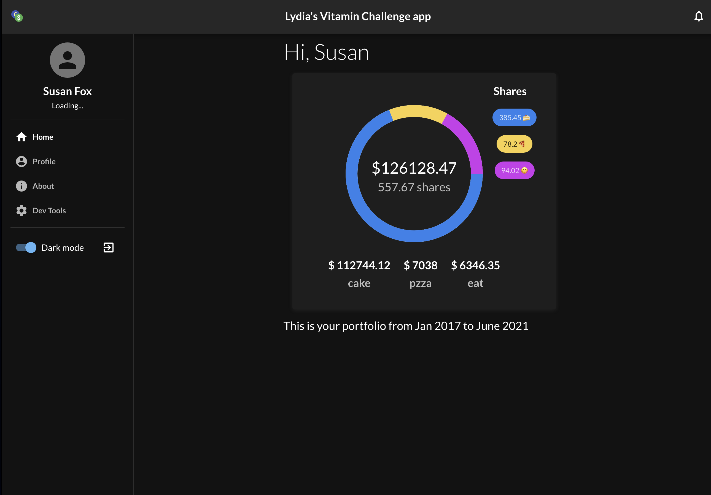

# Lydia's Vitamin Challenge

## Getting started

1. Clone or download the repo
2. `yarn` or `npm install` 
3. `yarn start` or `yarn dev` or `npm start` or `npm run dev`
4. Test the app in the browser.
Runs the app in the development mode. 
Open [http://localhost:3000](http://localhost:3000).

If you accidently log out, type any (fake is fine, like 123@123.com) input and you will be redirected to Home page. 

## Notes

- I used this to starter project for efficiency 
https://github.com/karpolan/react-typescript-material-ui-with-auth-starter

### Things I would have done with more time

- questionnaire to extract user info
- save user info in AppContext or Redux
- Make a proper Line Graph 
- Remove unnecessary files 
- handle loading 
- add tests
- ...

~~Please let me know if you need my **api key** from the financial market site.
I put it inside an .env file for common practice.~~

## Screenshot

